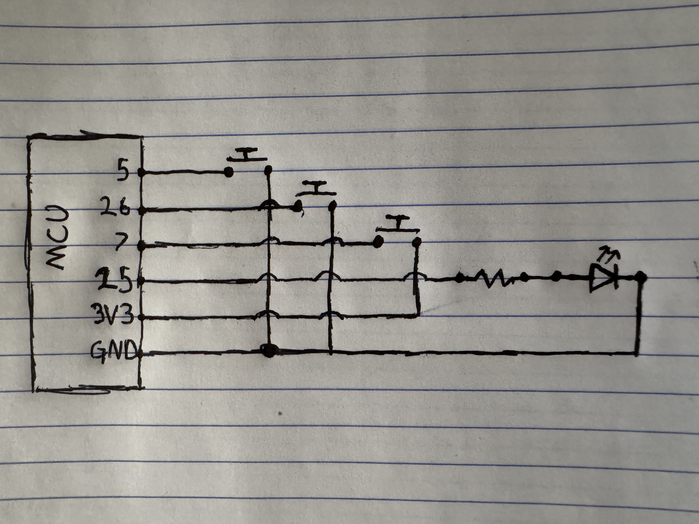

### It is meant for learning how to program the esp32 with the esp_idf.

### This program will have multiple revisions.

-   v1 - 2 buttons one led on/off -- complete
-   v2 - 2 buttons 2 leds on/off -- complete
-   v3 - 2 buttons 1 led pwm -- complete
-   v4 - 3 buttons 1 led pwm + on/off -- complete

#### Pinout:
- button_on_off - pin 
- button_1 - pin 

